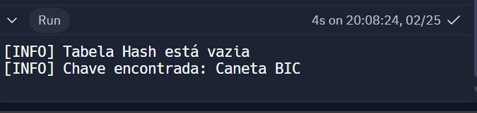
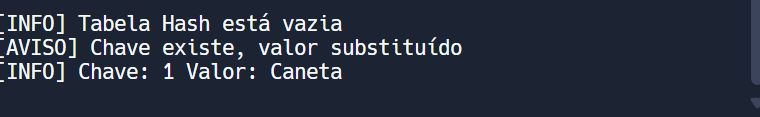
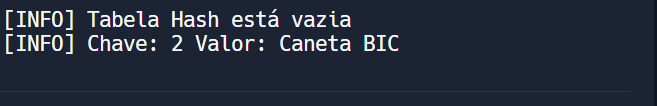
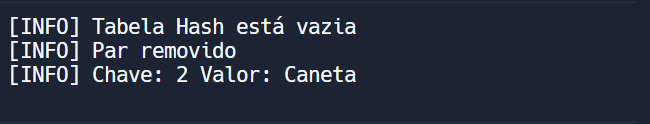

# Atividade ponderada da sprint 2
Esta é uma atividade ponderada do curso de Sistemas de Informação.
Aluno: Matheus Ribeiro dos Santos.
Turma: 10.

## O que é uma Hash Table?
A tabela hash é uma estrutura de dados que implementa uma coleção de pares chave-valor, onde as chaves são únicas. Utilizando uma função hash para cálcular o índice onde cada par chave-valor deve ser armazenado na tabela, esse tipo de implementação permite o acesso rápido aos dados, tendo em vista que a posição de cada elemento é determinada pela função de hash.

## Qual a diferença entre Hash Table e Distributed Hash Table?
A diferença principal é a distribuição dos dados, enquanto na hash table temos uma centralização, a implementação da DHT pressupõe a distribuição dos dados nos nós da tabela.

## Por que esse tipo de estrutura de dados é utilizado no contexto de aplicações distribuídas, mais especificamente, no blockchain?
Essa estrutura de dados é muito utilizada em aplicações distribuidas por diversas razões: recuperação rápida de dados, dsitribuição uniforme de dados, tolerância a falhas, integridade dos dados, eficiência de armazenamento e acesso. Todos esses aspectos positivos de se utilizar hash table em contextos distribuidos se dá por conta da característica da função hash, que por sua vez é determinística, rápida, uniforme, possuí tamanho fixo de saída, aleatoriedade aparente e eficiência de colisões.
Uma função hash bem projetada desempenha um papel fundamental em garantir a eficácia e a eficiência de estruturas de dados como hash tables, bem como em muitos outros contextos, como criptografia, controle de integridade de dados e geração de identificadores únicos.

## Enunciado:
Implemente um Distributed Hash Table (DHT) em
C++ utilizando uma IDE de sua escolha (recomendado Replit). Descreva
pelo menos 5 casos de teste para as principais funcionalidades de uma
DHT. Envie seu link do repositório do GitHub.

## Casos de teste
1. Testar a recuperação de um item existente: inserir um item na tabela e em seguida recuperá-lo para garantir que a recuperação esteja funcionando corretamente.
```c++
//Método da classe tabelaHash para procurar de acordo com uma chave:

void TabelaHash::buscarTabela(int chave) {
  int valorHash = funcaoHash(chave);
  auto& celula = tabela[valorHash];
  auto itr = begin(celula);
  bool chaveExiste = false;
  for (; itr != end(celula); itr++) {
    if (itr->first == chave) {
      chaveExiste = true;
      cout << "[INFO] Chave encontrada: " << itr->second << endl;
      break;
    }
  }
  if (!chaveExiste) {
    cout << "[AVISO] Chave não encontrada" << endl;
  }
}

// Chamada do método:
int main() {
  TabelaHash HT;
  if (HT.estaVazia()) {
    cout << "[INFO] Tabela Hash está vazia" << endl;
  } else {
    cout << "[AVISO] Tabela Hash não está vazia" << endl;
  }

  HT.insereItem(1, "Caneta BIC");
  HT.buscarTabela(1);
  return 0;
}
```
Output no terminal:


2. Teste de Tratamento de Colisões: inserir dois valores com a mesma chave na tabela hash e verificar se o código implementado possui um tratamento adequado de colisões.
```c++
// Insere dois itens com a mesma chave na tabela
HT.insereItem(1, "Caneta BIC");
HT.insereItem(1, "Caneta");
// Mostra a tabela
HT.mostrarTabela();
```
Output do terminal:


3. Teste de Cálculo de Hash Correto: inserir uma chave e valor na tabela hash e verificar se o cálculo do hash está correto, comparando o resultado com o valor esperado.
```c++
// Função hash
int TabelaHash::funcaoHash(int chave) {
  return chave % gruposHash;
}
```
Considerando que a função hash é o resto da divisão pelo tamanho da tabela.
Output do terminal:


4. Testar a remoção de um item existente: inserir um item na tabela, removê-lo e em seguida tentar recuperá-lo novamente para garantir que tenha sido removido corretamente.
```c++
HT.insereItem(2, "Caneta BIC");
HT.removeItem(2);
HT.insereItem(2, "Caneta");
HT.mostrarTabela();
```
Output no terminal:


5. Teste de Performance de Pesquisa na Tabela Hash: Avaliar a performance de pesquisa na tabela hash, medindo o tempo necessário para pesquisar por uma chave específica.

Para o teste de performance (tempo) da pesquisa pesquisei na internet para ter um exemplo de implementação.
```c++
#include <iostream>
#include <unordered_map>
#include <chrono>

int main() {
    // Criação e preenchimento da tabela hash
    std::unordered_map<int, std::string> tabelaHash;
    for (int i = 0; i < 1000000; ++i) {
        tabelaHash[i] = "valor" + std::to_string(i);
    }

    // Chave para pesquisa
    int chave = 500000;

    // Medição do tempo de pesquisa
    auto start = std::chrono::high_resolution_clock::now();

    // Pesquisa pela chave na tabela hash
    auto it = tabelaHash.find(chave);

    auto end = std::chrono::high_resolution_clock::now();
    auto duration = std::chrono::duration_cast<std::chrono::microseconds>(end - start);

    // Verifica se a chave foi encontrada
    if (it != tabelaHash.end()) {
        std::cout << "Chave encontrada! Valor: " << it->second << std::endl;
    } else {
        std::cout << "Chave não encontrada!" << std::endl;
    }

    // Imprime o tempo de pesquisa
    std::cout << "Tempo de pesquisa: " << duration.count() << " microssegundos" << std::endl;

    return 0;
}
```